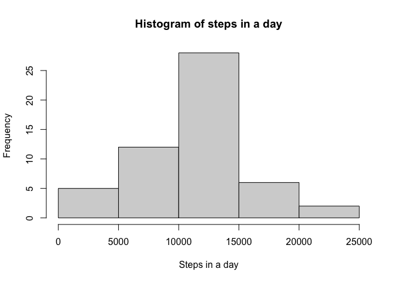
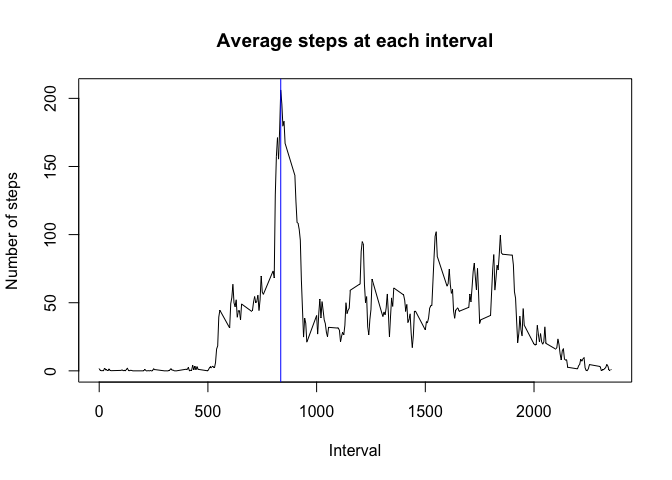
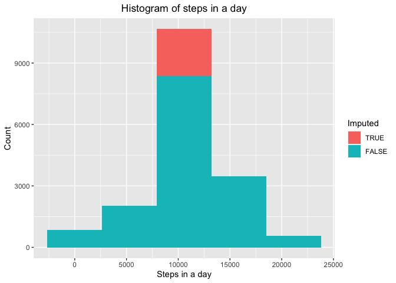
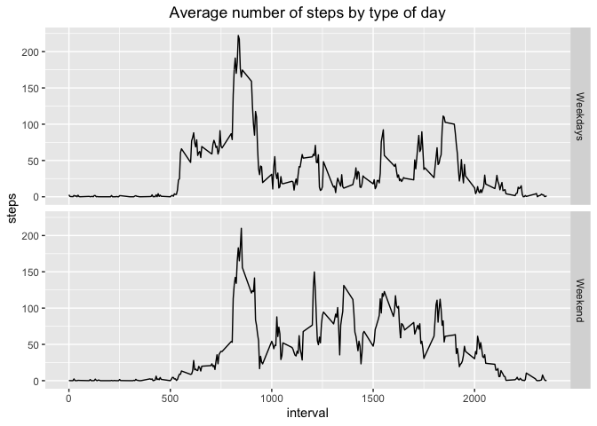

In this file we analyse some activity monitoring data. 
First, let us load it: 

## Loading and preprocessing the data


```r
M_data = read.csv("activity.csv", colClasses = c("numeric", "Date", "numeric"))
# M_data$start_time= with(M_data,
#                         paste(sprintf("%02d",floor(interval/60)),sprintf("%02d",interval%%60),sep = ":"))
```


## What is mean total number of steps taken per day?


```r
library(dplyr)
```

```
## 
## Attaching package: 'dplyr'
```

```
## The following objects are masked from 'package:stats':
## 
##     filter, lag
```

```
## The following objects are masked from 'package:base':
## 
##     intersect, setdiff, setequal, union
```

```r
by_date = group_by(M_data, date) %>% summarise(steps = sum(steps))
```

```
## `summarise()` ungrouping output (override with `.groups` argument)
```

```r
hist(by_date$steps,
     xlab = "Steps in a day", 
     main = "Histogram of steps in a day")
```

<!-- -->

```r
mean_steps_per_day = mean(by_date$steps, na.rm = TRUE)
median_steps_per_day = median(by_date$steps, na.rm = TRUE)
```

The mean number of steps per day is 10766, 
and the median number of steps per day is 10765.

## What is the average daily activity pattern?


```r
by_time = group_by(M_data, interval) %>% summarise(steps = mean(steps, na.rm = TRUE))
```

```
## `summarise()` ungrouping output (override with `.groups` argument)
```

```r
plot(x = by_time$interval, y = by_time$steps, 
     type = "l",
     xlab = "Interval",
     ylab = "Number of steps",
     main = "Average steps at each interval")
```

<!-- -->

## Imputing missing values

Let us now process the missing values. 
Since the only measured quantity is the number of steps, 
this is the only column where missing values are found. 
On the other hand, looking at the plot of mean steps at each hour 
seams sensible to use this data to fill the missing values, 
as there is a lot of variability between some times and others.


```r
M_data_f = M_data # M_data, filled

for (i in seq_along(M_data_f$steps)){
  if (is.na(M_data$steps[i])){
    M_data_f$steps[i] = by_time[by_time$interval == M_data_f$interval[i],]$steps
    M_data_f$Imputed[i] = TRUE
  }
  else{M_data_f[M_data_f$date == M_data[i,]$date,]$Imputed = FALSE}
}
```

Is there any missing value left? FALSE.

Now we redo the histogram with the imputed values: 


```r
library(ggplot2)
by_date_f = group_by(M_data_f, date) %>% summarise(steps = sum(steps), Imputed = Imputed)
```

```
## `summarise()` regrouping output by 'date' (override with `.groups` argument)
```

```r
ggplot(by_date_f, aes(steps, fill = factor(Imputed, levels = c(TRUE, FALSE)))) + geom_histogram(bins = 5) + labs(fill="Imputed", title = "Histogram of steps in a day") + xlab("Steps in a day") + ylab("Count") + theme(plot.title = element_text(hjust = 0.5))
```

<!-- -->

```r
mean_steps_per_day_f = mean(by_date$steps, na.rm = TRUE)
median_steps_per_day_f = median(by_date$steps, na.rm = TRUE)
```

With the imputed values the mean number of steps per day is 10766, 
and the median number of steps per day is 10765. 
That is, they are not affected at all. 
Furthermore, we can see in the histogram above that all the days with imputed values are in the central bar. 

## Are there differences in activity patterns between weekdays and weekends?


```r
M_data_f["is_weekend"] = factor(weekdays(M_data_f$date) %in% c("Friday", "Saturday", "Sunday"), 
                                labels = c("Weekdays", "Weekend"))

by_time_f = group_by(M_data_f, interval, is_weekend) %>% summarise(steps = mean(steps, na.rm = TRUE))
```

```
## `summarise()` regrouping output by 'interval' (override with `.groups` argument)
```

```r
ggplot(by_time_f, aes(x = interval, y = steps), type = "l") + geom_line() + facet_grid(rows = vars(is_weekend)) + labs(xlab = "Interval", ylab = "Steps", title = "Average number of steps by type of day") + theme(plot.title = element_text(hjust = 0.5))
```

<!-- -->
